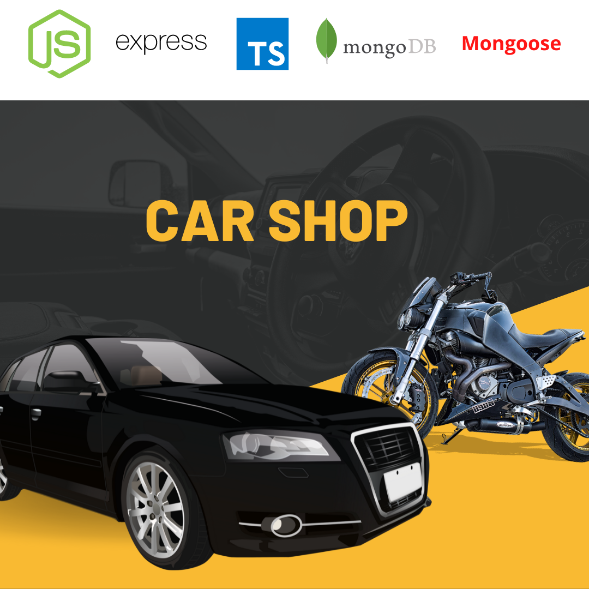

# Car Shop

## Projeto realizado durante o módulo de back-end na Trybe 💚
---

## Tecnologias utilizadas:

---
## Sobre o desenvolvimento:

* Projeto individual;

* Aplica os princípios de Programação Orientada a Objetos (POO) para a construção de uma API com CRUD para gerenciar uma concessionária de veículos, utilizando a ODM Mongoose.

* Aplicação coberta por testes unitários.
